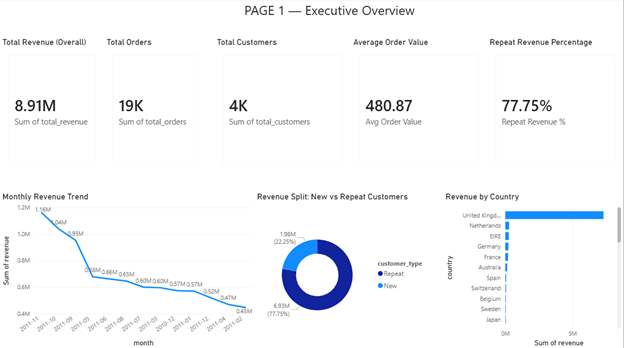
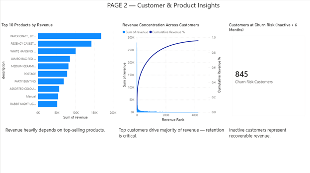

# Project 1: End-to-End Retail Business SQL Analysis

## Project Overview

This project demonstrates **end-to-end SQL-driven business analysis** on a retail / e-commerce transactional dataset. The objective is not only to write correct SQL queries, but to **answer real-world business questions**, derive insights, and make data-backed recommendations — exactly how a **Data Analyst operates in a production environment**.

The project progresses from **core KPI analysis** to **advanced analytical case studies** using CTEs and window functions, with insights documented, a lightweight Power BI dashboard built on top of a SQL analytics layer, and version-controlled on GitHub.

---

## Business Objectives

* Measure overall business performance through key revenue metrics
* Analyze revenue trends over time
* Understand customer behavior (new vs repeat customers)
* Identify high-value customers and revenue concentration
* Estimate customer churn using inactivity-based proxies
* Translate SQL outputs into actionable business insights

---

## Tech Stack

* **Database:** MySQL
* **Language:** SQL
* **Version Control:** Git & GitHub
* **Visualization (Planned):** Power BI
* **Data Type:** Retail / E-commerce transactional data

---


## Business Questions Answered

This project answers questions such as:

* How much revenue does the business generate overall?
* How does revenue evolve month-over-month?
* Which products and countries drive the most revenue?
* Is revenue driven more by new or repeat customers?
* How concentrated is revenue across customers and products?
* Which customers are at risk of churn due to inactivity?

---

## Analysis Breakdown

### Core Business Analysis (`core_business_analysis.sql`)

Focuses on foundational KPIs used by business stakeholders:

* Total revenue
* Monthly revenue trends
* Top products by revenue
* Revenue by country
* Average Order Value (AOV)

These metrics provide a **high-level understanding of business health**.

---

### Advanced SQL Case Study (`advanced_case_study.sql`)

Addresses deeper analytical and strategic questions using advanced SQL:

* Customer lifecycle analysis (new vs repeat customers)
* Revenue concentration analysis (Pareto / NTILE)
* Month-over-month revenue growth
* Rolling revenue averages
* Customer Lifetime Value (CLV)
* Churn proxy using last purchase date

**Advanced SQL techniques used:**

* Common Table Expressions (CTEs)
* Window functions (`NTILE`, `LAG`, running totals)
* Time-series analysis
* Business-driven segmentation

---

## Key Insights & Business Impact

Key findings from the analysis include:

* Revenue is highly concentrated among a small group of customers and products
* Repeat customers contribute a significant portion of total revenue
* Average Order Value presents opportunities for growth through bundling and cross-selling
* A segment of customers has been inactive for over 6 months, indicating churn risk

Detailed insights and recommendations are documented in:

```
/insights/project1_sql_insights.md
```

---
## Power BI Dashboard Preview

### Executive Overview


### Customer & Product Insights


---

## Author

**Abhijeet Singh Pawar**
Data Analyst 

---

⭐ If you find this project useful, feel free to star the repository!

